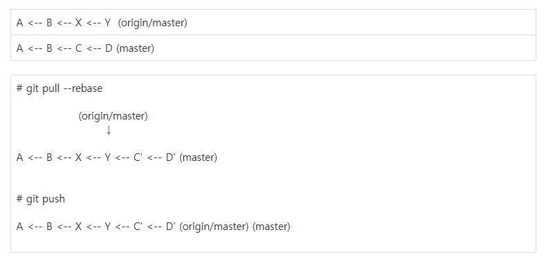

# MLFQ Simulator

운영체제 과제로서 C언어로 구현한 **Multi-Level Feedback Queue (MLFQ)** CPU 스케줄링 시뮬레이터입니다.

## 개요

MLFQ는 여러 개의 우선순위 큐를 사용하여, 프로세스의 CPU 사용 패턴에 따라 동적으로 우선순위를 조정하는 스케줄링 알고리즘입니다. 이 시뮬레이터는 trace1.txt 파일에서 프로세스 정보를 읽어 MLFQ 스케줄링을 수행하고, 각 프로세스의 turnaround time과 response time을 출력합니다.

## 시뮬레이터 설정

| 항목 | 값 |
|------|-----|
| 큐 개수 | 3개 (q1, q2, q3) |
| q1 time slice | 10 |
| q2 time slice | 10 |
| q3 time slice | 20 |
| boost time | 50 (q2, q3 → q1) |
| 시간 최소 단위 | 1 |
| 최대 프로세스 수 | 100 |

## 입력 형식

`trace1.txt` 파일에서 프로세스 정보를 읽어옵니다.

```
PID  arrival_time  run_time  IO_start_time  IO_run_time
```

- **IO_start_time**: CPU 실행 시작 후 I/O가 발생하기까지의 시간
- **IO_run_time**: I/O 작업 수행 시간 (0이면 I/O 없음)

예시:
```
1 0 30 0 0      → PID 1, 0초 도착, 30초 실행, I/O 없음
3 1 45 5 10     → PID 3, 1초 도착, 45초 실행, 5초 후 I/O 시작하여 10초간 수행
```

## 구현 방식

### 자료구조

- **Process**: 연결 리스트 노드 형태. PID, 도착 시간, 실행 시간, I/O 정보 등을 포함
- **Queue**: head/tail 포인터 + time quantum. FIFO 방식의 enqueue/dequeue
- **IO**: I/O 작업 중인 프로세스를 관리. 잔여 I/O 시간과 복귀할 큐 정보를 저장

### 스케줄링 로직

1. 프로세스를 arrival_time 기준 오름차순으로 정렬하여 q1에 enqueue
2. 매 반복마다 q1 → q2 → q3 순으로 비어있지 않은 큐에서 프로세스를 dequeue
3. 실행 시간은 잔여 실행 시간과 time quantum 중 작은 값으로 결정
4. I/O 작업이 예정된 프로세스는 IO_start_time만큼만 CPU를 사용한 뒤 I/O로 진입

### 1초 단위 시뮬레이션

실행을 한 번에 처리하지 않고, for 루프를 통해 **1초 단위로** 시뮬레이션합니다. 매 tick마다:
- I/O 중인 프로세스의 잔여 시간 감소
- I/O 완료 시 해당 프로세스를 지정된 큐로 복귀
- CPU 실행과 I/O가 병렬로 동작

### I/O 처리

- I/O는 프로세스 생애에서 **1회만** 발생
- 각 프로세스의 I/O는 **개별적으로 동시에** 진행
- I/O 완료 후 복귀 큐: 해당 프로세스의 직전 CPU 사용 시간이 time slice보다 작으면 **같은 큐**, 아니면 **한 단계 강등**

### Boost

- current_time이 50의 배수가 될 때마다 q2, q3의 모든 프로세스를 q1으로 이동
- starvation 방지 목적

### 우선순위 처리

같은 시점에 I/O 완료와 boost가 동시에 발생하면 **I/O 완료를 먼저** 처리하며, 해당 프로세스를 먼저 복귀시킴

## 실행 방법

```bash
gcc -o mlfq mlfq.c
./mlfq
```

## 실행 결과 (trace1.txt)

```
All processes completed.
-------------------------------------
PID | Turnaround time | response time
1   | 195             | 0
2   | 129             | 19
3   | 284             | 29
4   | 132             | 67
5   | 120             | 10
6   | 104             | 34
7   | 314             | 39
8   | 263             | 58
9   | 231             | 71
10  | 364             | 49
-------------------------------------
final_completion_time : 365
```

## 파일 구조

```
├── README.md
├── Homework1.pdf    # 과제 명세서
├── mlfq.c           # MLFQ 시뮬레이터 소스 코드
├── mlfq             # 실행파일
├── trace1.txt       # 테스트 입력 파일
├── MEMO.txt         # 참고용
└── images           # 첨부 이미지 폴더
    └── git_pull_rebase.png
```
## 배운점

### 1. Git / GitHub 사용법

| 명령어 | 설명 |
|-----|-----|
| git init | 현재 디렉토리를 Git 저장소로 초기화 / **처음에 꼭 해야됨** |
| git add . | 모든 변경된 파일을 스테이징 영역에 추가 |
| git commit -m "~~" | 스테이징된 변경사항을 커밋 메시지와 함께 저장 / **커밋 메시지는 동사로 시작 (Add, Remove, Fix 등)** |
| git branch -m master main | 현재 브랜치 이름을 master에서 main으로 변경 / **초기 브랜치가 master여서 변경필요** |
| git remote add origin "(레포지토리주소)" | 원격 저장소를 origin이라는 이름으로 연결 |
| git remote -v | 연결된 원격 저장소 주소 확인 |
| git pull origin main --rebase | 원격의 변경사항을 가져와서 로컬 커밋 위에 재배치 |
|  |
| git push origin main | 로컬 커밋을 원격 저장소의 main 브랜치에 업로드 |
| git push origin main --force | 로컬 상태를 원격에 강제로 덮어씌우기 **(협업 시 주의)** |
| git checkout -- . | 커밋되지 않은 로컬 변경사항 삭제 |
| git checkout -b develop | develop 브랜치 생성 후 이동 |
| git checkout master | master 브랜치로 이동 |


### 2. C언어

#### 2-1. 포인터 배열의 qsort

**일반 배열의 qsort**

일반 배열에서는 `qsort`가 비교 함수에 원소의 주소를 넘겨준다. 역참조 한 번으로 값을 꺼낼 수 있다.
```c
int arr[] = {3, 1, 2};
qsort(arr, 3, sizeof(int), compare);

int compare(const void *a, const void *b){
    int arg1 = *(int*)a;       // &arr[i] → 역참조 → int 값
    int arg2 = *(int*)b;
    return arg1 - arg2;
}
```

**포인터 배열의 qsort**

포인터 배열도 동일하게 원소의 주소를 넘기지만, 원소 자체가 포인터이므로 포인터의 주소(이중 포인터)가 넘어온다. 따라서 역참조를 한 번 더 해야 한다.
```c
Process* processes[] = {p1, p2, p3};
qsort(processes, 3, sizeof(Process*), compare);  // sizeof(Process*)인 점에 주의

int compare(const void *a, const void *b){
    Process* arg1 = *(Process* const*)a;   // &processes[i] → 역참조 → Process* 포인터
    Process* arg2 = *(Process* const*)b;
    return arg1->arrival_time - arg2->arrival_time;
}
```

**핵심 차이 요약**

| | 일반 배열 | 포인터 배열 |
|---|---|---|
| 비교 함수에 넘어오는 것 | 원소의 주소 | 포인터의 주소 (이중 포인터) |
| 캐스팅 | `*(int*)a` | `*(Process* const*)a` |
| sizeof 인자 | `sizeof(int)` | `sizeof(Process*)` |

#### 2-2. fscanf

`scanf`가 키보드에서 입력받는 것이라면, `fscanf`는 파일에서 입력받는 함수이다.
```c
FILE *fp = fopen("trace1.txt", "r");

int pid, arrival, run, io_start, io_run;
while (fscanf(fp, "%d %d %d %d %d", &pid, &arrival, &run, &io_start, &io_run) == 5) {
    // 읽어온 데이터 사용
}

fclose(fp);
```

**핵심 포인트**

- 반환값은 **성공적으로 읽은 항목 수**이다. 위 예시에서는 5개를 읽으므로 `== 5`로 비교하면 파일 끝이나 읽기 실패를 자연스럽게 감지할 수 있다.
- `%d` 같은 형식 지정자가 공백과 줄바꿈을 자동으로 건너뛰므로, 각 줄에 데이터가 있어도 별도 처리 없이 읽어온다.
- 파일을 다 읽으면 `EOF`(-1)를 반환하여 while 루프가 종료된다.

#### 2-3. Segmentation Fault (Core dumped)
